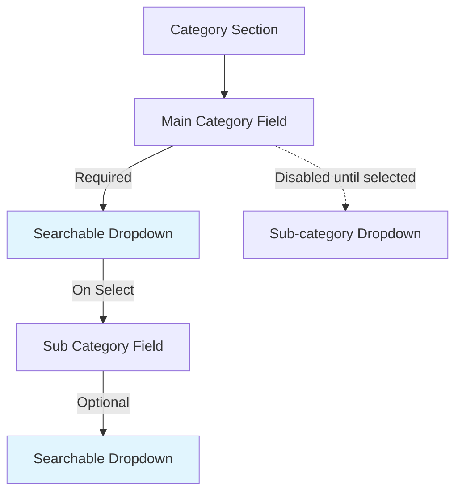

# Plan: Category Dropdown - Main Category + Optional Sub-category

## Current Implementation Analysis

The current category selection in [`src/app/dashboard/vendor/my-listing/create/form-component/basic-info.tsx`](src/app/dashboard/vendor/my-listing/create/form-component/basic-info.tsx:539) has:

1. **Main Category** - Uses a basic `<Select>` component (not searchable)
2. **Sub-categories** - Uses a `<Select>` component with search functionality

```
Current Flow:
[Select Main Category ▼] → Shows all main categories (NOT searchable)
    ↓ (on selection)
[Select Subcategory ▼] → Shows filtered subcategories (searchable ✓)
```

> Note: The subcategories ARE already searchable via the Select component's built-in search.

---

## Proposed Implementation

### Architecture Overview



### Key Changes

#### 1. Create Reusable Searchable Select Component

Create a new component at [`src/components/ui/searchable-select.tsx`](src/components/ui/searchable-select.tsx) that wraps the current Select with search functionality:

```typescript
interface SearchableSelectProps {
  options: { value: string; label: string }[];
  value: string;
  onChange: (value: string) => void;
  placeholder: string;
  disabled?: boolean;
  searchPlaceholder?: string;
}
```

#### 2. Update Category Fields in Forms

Modify the category selection to use two searchable dropdowns:

| Field | Required | Behavior |
|-------|----------|----------|
| **Main Category** | ✅ Yes | Searchable dropdown - must select first |
| **Sub Category** | ❌ No | Disabled until main is selected, then searchable |

#### 3. Files to Modify (5 files total)

**Vendor Dashboard:**
- `src/app/dashboard/vendor/my-listing/create/form-component/basic-info.tsx`
- `src/app/dashboard/vendor/my-listing/edit/form-component/basic-info.tsx`

**Listing Agent Dashboard:**
- `src/app/dashboard/listing-agent/my-listing/create/form-component/basic-info.tsx`
- `src/app/dashboard/listing-agent/my-listing/edit/form-component/basic-info.tsx`

**Manual Claim:**
- `src/app/claim/manual/form-component/basic-info.tsx`

---

## Implementation Steps

### Step 1: Create Searchable Select Component

Create [`src/components/ui/searchable-select.tsx`](src/components/ui/searchable-select.tsx):

```typescript
"use client";
import { useState, useMemo } from "react";
import { Check, ChevronDown, Search } from "lucide-react";
import { cn } from "@/lib/utils";

interface Option {
  value: string;
  label: string;
}

interface SearchableSelectProps {
  options: Option[];
  value: string;
  onChange: (value: string) => void;
  placeholder?: string;
  disabled?: boolean;
  searchPlaceholder?: string;
  error?: string;
}

export function SearchableSelect({
  options,
  value,
  onChange,
  placeholder = "Select an option",
  disabled = false,
  searchPlaceholder = "Search...",
  error
}: SearchableSelectProps) {
  const [isOpen, setIsOpen] = useState(false);
  const [search, setSearch] = useState("");

  const filteredOptions = useMemo(() => {
    if (!search) return options;
    return options.filter(option =>
      option.label.toLowerCase().includes(search.toLowerCase())
    );
  }, [options, search]);

  const selectedOption = options.find(opt => opt.value === value);

  return (
    <div className="relative">
      <button
        type="button"
        onClick={() => !disabled && setIsOpen(!isOpen)}
        disabled={disabled}
        className={cn(
          "flex h-10 w-full items-center justify-between rounded-lg border border-gray-300 px-4 text-sm",
          disabled && "cursor-not-allowed bg-gray-50 opacity-50",
          error && "border-red-500"
        )}
      >
        <span className={cn(!selectedOption && "text-gray-400")}>
          {selectedOption?.label || placeholder}
        </span>
        <ChevronDown className="h-4 w-4 opacity-50" />
      </button>

      {isOpen && (
        <div className="absolute z-50 mt-1 w-full rounded-lg border bg-white shadow-lg">
          <div className="flex items-center border-b px-3">
            <Search className="h-4 w-4 opacity-50" />
            <input
              type="text"
              value={search}
              onChange={(e) => setSearch(e.target.value)}
              placeholder={searchPlaceholder}
              className="flex-1 py-2 px-2 text-sm outline-none"
              autoFocus
            />
          </div>
          <div className="max-h-60 overflow-auto p-1">
            {filteredOptions.length === 0 ? (
              <p className="p-3 text-sm text-gray-500">No results found</p>
            ) : (
              filteredOptions.map((option) => (
                <button
                  key={option.value}
                  type="button"
                  onClick={() => {
                    onChange(option.value);
                    setIsOpen(false);
                    setSearch("");
                  }}
                  className={cn(
                    "flex w-full items-center justify-between rounded px-3 py-2 text-sm hover:bg-gray-100",
                    option.value === value && "bg-gray-100"
                  )}
                >
                  {option.label}
                  {option.value === value && <Check className="h-4 w-4" />}
                </button>
              ))
            )}
          </div>
        </div>
      )}
      
      {error && <p className="text-red-500 text-xs mt-1">{error}</p>}
    </div>
  );
}
```

### Step 2: Update Basic Info Form

In each basic-info.tsx file:

```typescript
// State for main and sub category separately
const [selectedMainCategoryId, setSelectedMainCategoryId] = useState<string>("");
const [selectedSubCategoryId, setSelectedSubCategoryId] = useState<string>("");

// Replace the main category Select with SearchableSelect
<SearchableSelect
  options={mainCategories.map(cat => ({ 
    value: String(cat.id), 
    label: cat.name 
  }))}
  value={selectedMainCategoryId}
  onChange={(value) => {
    setSelectedMainCategoryId(value);
    setSelectedSubCategoryId(""); // Reset sub
    setValue("category_ids", [value], { shouldValidate: true });
  }}
  placeholder={`Select ${textConfig.label.toLowerCase()} main category`}
  searchPlaceholder="Search main category..."
  error={errors.category_ids ? "Main category is required" : undefined}
/>

// Replace subcategories with SearchableSelect (conditionally rendered)
{selectedMainCategoryId && subCategories.length > 0 && (
  <SearchableSelect
    options={subCategories.map(cat => ({ 
      value: String(cat.id), 
      label: cat.name 
    }))}
    value={selectedSubCategoryId}
    onChange={(value) => {
      setSelectedSubCategoryId(value);
      // Include both main and sub in category_ids
      setValue("category_ids", [selectedMainCategoryId, value], { shouldValidate: true });
    }}
    placeholder="Select sub category (optional)"
    searchPlaceholder="Search sub category..."
  />
)}
```

### Step 3: Update Submission Logic

In the submit handler, ensure both main and sub category IDs are sent:

```typescript
// Build category_ids array
let categoryIds: number[] = [];
if (selectedMainCategoryId) {
  categoryIds.push(Number(selectedMainCategoryId));
}
if (selectedSubCategoryId) {
  categoryIds.push(Number(selectedSubCategoryId));
}

submissionData.category_ids = categoryIds;
```

---

## UI Mockup

```
┌─────────────────────────────────────────────────────────────┐
│  Main Category *                                            │
│  ┌─────────────────────────────────────────────────────┐   │
│  │ 🔍 Search category...                           ▼  │   │
│  └─────────────────────────────────────────────────────┘   │
│                                                             │
│  ┌ Food & Dining                                    ▼   │  ← Selected
│  └─────────────────────────────────────────────────────┘   │
└─────────────────────────────────────────────────────────────┘

┌─────────────────────────────────────────────────────────────┐
│  Sub Category (Optional)                                     │
│  ┌─────────────────────────────────────────────────────┐   │
│  │ 🔍 Search sub category...                      ▼  │   │
│  └─────────────────────────────────────────────────────┘   │
│                                                             │
│  ┌ Restaurants                                         │  ← Selected  
│  └─────────────────────────────────────────────────────┘   │
└─────────────────────────────────────────────────────────────┘

When Main Category NOT selected:
┌─────────────────────────────────────────────────────────────┐
│  Sub Category (Optional)                                     │
│  ┌─────────────────────────────────────────────────────┐   │
│  │ Select main category first                          │   │  ← Disabled
│  └─────────────────────────────────────────────────────┘   │
└─────────────────────────────────────────────────────────────┘
```

---

## Summary of Changes

| Aspect | Current | New |
|--------|---------|-----|
| Main Category | Basic Select (not searchable) | **Searchable Select** |
| Sub Category | Basic Select (searchable ✓) | **Remains searchable** |
| Sub-category dependency | Already exists | **Strengthen: Always disabled until main selected** |
| Sub-category requirement | Multiple selection allowed | **Single selection (optional)** |
| Data sent to API | Array of category IDs | **Array of main + sub IDs** |

---

## Ready to Implement?

Let me know if you'd like me to:
1. **Proceed with implementation** - I'll create the SearchableSelect component and update all 4 basic-info.tsx files
2. **Modify the plan** - Let me know what changes you'd like to make
